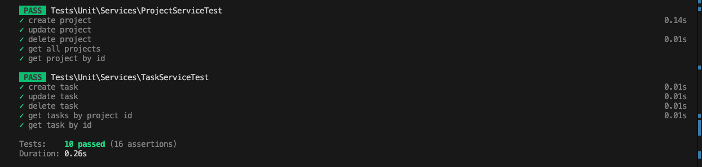

# Project Management Tool - README

## Overview

The Project Management Tool is a web-based application designed to manage projects and tasks. It allows users to create, update, delete, and view projects and tasks efficiently. The system also includes a role-based access control mechanism where users have different permissions based on their role (Admin or Regular User). Admin users have full control over the projects and tasks, while regular users can only manage the tasks they own.

### Key Features

-   **Project Management**: Create, update, delete, and view projects.
-   **Task Management**: Manage tasks within projects, including creating, updating, deleting, and filtering tasks by status.
-   **Role-Based Access Control**: Admin users can manage all projects and tasks, while regular users can only manage their own tasks.
-   **Real-time Feedback**: Uses Livewire and Alpine.js to provide a responsive and interactive user experience.
-   **REST API**: A RESTful API is available for programmatic access to the project and task management functionalities. The Postman collection is attached in the root directory for easy API testing.
-   **Database Seeding**: Predefined users, projects, and tasks are created using database seeders.
-   **API Token**: Users can create an API token from the dashboard, which can be used to authenticate requests to the API.
-   **Service Layer Pattern**: The application follows the Service Layer Pattern, which encapsulates the business logic in service classes. This separation of concerns makes the application more modular, easier to test, and simpler to maintain.

## Live Demo

You can test the live version of the project at [http://dev.beylaai.com](http://dev.beylaai.com).

## Installation Guide

### Prerequisites

-   **PHP 8.2 or later**
-   **Composer**
-   **Node.js & npm**
-   **MySQL or any other compatible database**
-   **SQLite (for testing)**

### Steps

1. **Clone the Repository**

    ```bash
    git clone https://github.com/yourusername/project-management-tool.git
    cd project-management-tool
    ```

2. **Install Dependencies**

    ```bash
    composer install
    npm install
    ```

3. **Environment Configuration**

    - Copy the `.env.example` file to `.env` and update the database credentials and other settings as needed.

    ```bash
    cp .env.example .env
    ```

    - Generate the application key:

    ```bash
    php artisan key:generate
    ```

4. **Set Up the Database**

    - Run the migrations to create the necessary tables:

    ```bash
    php artisan migrate
    ```

    - Seed the database with predefined users, projects, and tasks:

    ```bash
    php artisan db:seed

    The seeder will create three users:

    Admin: admin@magicport.ai (password: magicport)
    User One: user1@magicport.ai (password: magicport)
    User Two: user2@magicport.ai (password: magicport)
    ```

5. **Run the Application**

    ```bash
    php artisan serve
    npm run dev
    ```

    - The application should now be running at `http://127.0.0.1:8000`.

6. **Testing**
    - The application uses SQLite for in-memory testing. Run the tests using PHPUnit:
    ```bash
    php artisan test
    ```

 ## Test Results

Below is a screenshot of our passed tests:

   

## REST API

The Project Management Tool provides a RESTful API for managing projects and tasks. The API is accessible via the `/api/v1` endpoint and requires authentication using API tokens.

### Authentication

-   **API Token**: Users can create an API token from their dashboard. This token must be included in the `Authorization` header as a Bearer token for all API requests.

-   **API Headers**:
    Authorization: Bearer {API_TOKEN} (Replace {API_TOKEN} with your actual API token)
    Content-Type: application/json

### API Endpoints

-   **Projects**

    -   `GET /api/v1/projects`: List all projects
    -   `POST /api/v1/projects`: Create a new project
    -   `GET /api/v1/projects/{id}`: Get details of a specific project
    -   `PUT /api/v1/projects/{id}`: Update a project
    -   `DELETE /api/v1/projects/{id}`: Delete a project

-   **Tasks**
    -   `GET /api/v1/tasks`: List all tasks
    -   `POST /api/v1/tasks`: Create a new task
    -   `GET /api/v1/tasks/{id}`: Get details of a specific task
    -   `PUT /api/v1/tasks/{id}`: Update a task
    -   `DELETE /api/v1/tasks/{id}`: Delete a task

### Postman Collection

A Postman collection for the API is included in the root directory (`REST-API-COLLECTION.postman_collection.json`). This collection includes pre-configured requests for all available API endpoints.

## Running Tests

The application includes a suite of unit tests to verify the functionality of the Project and Task management services. The tests use an in-memory SQLite database to ensure a clean testing environment.

-   **Running Tests**
    ```bash
    php artisan test
    ```

## Database Seeders

The `DatabaseSeeder` class runs all seeders at once, creating users, projects, and tasks. Here’s a brief overview of the seeders:

-   **UserSeeder**: Creates three users—an admin and two regular users.
-   **ProjectAndTaskSeeder**: Creates five projects, each with four tasks. Tasks are assigned equally between the two regular users.

## Enum: TaskStatus

The `TaskStatus` enum is used to represent the different statuses a task can have:

-   `TODO`
-   `IN_PROGRESS`
-   `DONE`

## License

This project is licensed under the MIT License.


